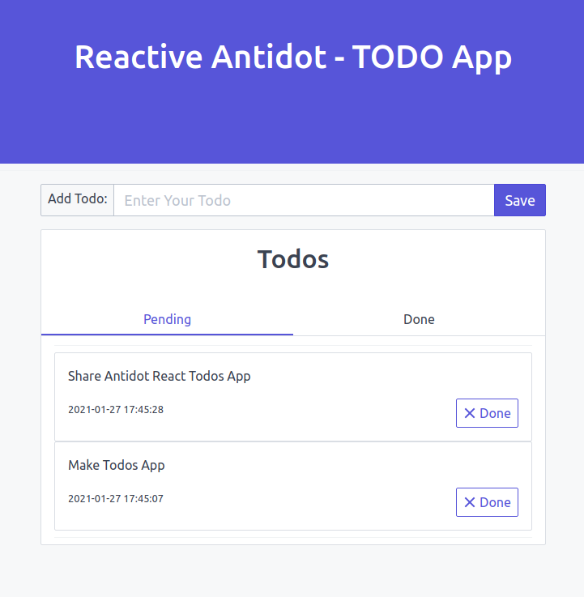

# Reactive Antidot Framework - TODO demo web app

Simple Todo app done with [Antidot Framework reactive starter](https://github.com/antidot-framework/reactive-antidot-starter)
using [react-mysql](https://github.com/friends-of-reactphp/mysql), [twig](https://twig.symfony.com/) and 
[spectre.css](https://picturepan2.github.io/spectre/) 

* [Features](#Features)
* [Services](#Services)
* [Libraries](#Libraries)
* [Installation](#Installation)



## Features

* [x] Add todo
* [x] Update Todo
* [x] Marc Todo as done
* [x] Delete Done Todo
* Suggest new features [opening an issue](https://github.com/antidot-framework/reactive-starter-todo-app/issues/new) or
  [make a Pull request](https://github.com/antidot-framework/reactive-starter-todo-app/compare) with your enhancements ;-)

## Services

* PHP 8
* MYSQL 5.7
* Redis

## Libraries

* [Antidot React Framework](https://github.com/antidot-framework/reactive-antidot-starter)
* [ReactPHP MySQL](https://github.com/friends-of-reactphp/mysql)  
* [Twig Template Engine](https://github.com/twigphp/Twig)
* [Monolog](https://github.com/Seldaek/monolog)

## Installation:

````
git clone git@github.com:antidot-fw/reactive-antidot-todo.git
cd reactive-antidot-todo
cd app
composer install
cd ..
docker-compose up --build
````

Open your browser at http://127.0.0.1:8080 and enjoy it! ;-D
